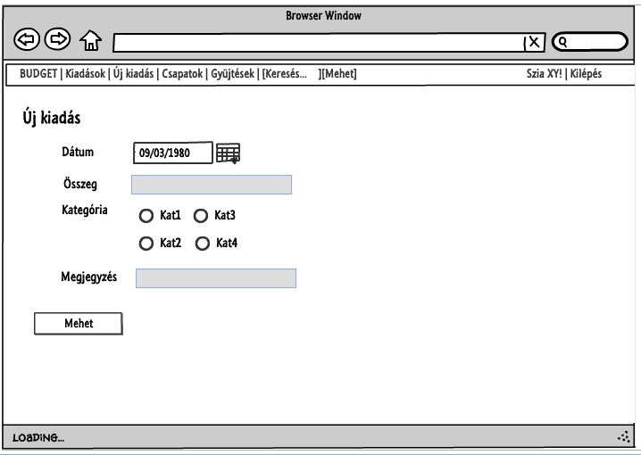

# Családi büdzsé tervező és nyilvántartó
> ELTE IK Alkalmazások fejlesztése beadandó | Pintér Arianna (NK3096)

## 1. Követelményanalízis

### 1.1 Célkitűzés
A program főbb céljai közé tartozik, hogy a felhasználók könnyen nyomon követhessék, hogy mire költenek; ellenőrzihessék gyermekeik kiadásait, valamint a családok, lakótársak, baráti társaságok megtervezhessék jövőbeli komolyabb közös kiadásaikat. Az alkalmazás ezen funkciói csak bejelentkezett felhasználóknak elérhetőek. Regisztráció után lehetőség van csoportok létrehozására, a csoportokon belül pedig teljes vagy korlátozott jogkörű userek szerepelnek.

###### Funckionális követelmények
- Regisztráció
- Bejelentkezés
- Bejelentkezett felhasználóként elérhető funkciók:
    - Saját kiadások, bevételek menedzselése (megtekintés, hozzáadás, törlés)
    - Saját csoportok megtekintése
    - Saját csoportok gyűjtéseinek megtekintése, hozzájárulás
    - Profiladatok megtekintése, szerkesztése
    - Csoportok létrehozása, kilépés a csoportból
- Kizárólag teljes jogkörű userként használható funckiók:
    - Gyűjtés indítása
    - Felhasználók meghívása a saját csoportokba teljes vagy korlátozott jogkörű userként
    - Csoport korlátozott jogkörű tagjainak kiadásainak megtekintése
    
###### Nem funkcionális követelmények
- **Átláthatóság**: Könnyen el lehessen igazodni az oldalon, logikus elrendezés, letisztult design
- **Bővíthetőség**: A program további funkciókkal való bővítésének, továbbfejlesztésének lehetővé tétele
- **Védelem**: A felhasználó tényleg csak olyan oldalakat nézhessen meg és használhasson amikre valóban van jogosultsága; a jelszavak kódolt tárolása; adatok validálása mielőtt elmentenénk őket az adatbázisba

### 1.2 Használati-eset modell

###### Felhasználói szerepkörök
- **Vendég**: Nem bejelentkezett felhasználó; számára csak a publikus oldalak érhetőek el: a bejelentkezés, a regisztráció és az oldal tematikáját leíró főoldal
- **Teljes jogkörű felhasználó**, *"Nagykorú"*: Létrehozhat csoportokat, gyűjtéseket és kezelheti őket; meghívhat felhasználókat a csoportjaiba; a csoportjaiban szereplő kiskorúak kiadásait is megnézheti
- **Korlátozott jogkörű felhasználó**, *"Kiskorú"*: Saját kiadásait, bevételeit kezelheti, de a csoportba nem hívhat meg tagokat, nem hozhat létre gyűjtéseket.

###### Use Case Diagram

###### Példafolyamat - Kiadás hozzáadása
1. Bejelentkezés
2. Ezután a felhasználó egyből a kiadásait listázó oldalra kerül, ahol lehetősége van új kiadást felvenni; az új tétel hozzáadása gombra nyomva lehet a felülethez jutni
3. Kiadás részletezése:
  - Összeg meghatározása
  - Dátum kiválasztása
  - Kategória kiválasztása
  - Opcionális esetben komment írása
4. A hozzáadás gombra kattintva a kiadás hozzáadódik a felhasználó tételeihez, majd a felhasználót átirányítjuk a tételeket listázó oldalra

## 2. Tervezés

### 2.1 Oldaltérkép

##### Publikus
- Belépés
- Regisztráció
- Felhasználók keresése
- Felhasználók profiljának megtekintése

##### Bejelentkezett
- Kiadások listázása
- Új kiadás
- Saját csoportok listázása
    - Új csoport létrehozása
- Csoport megtekintése
    - Kilépés a csoportból
    - *Új tag hozzáadása a csoporthoz*
    - *Új gyűjtés létrehozása*
- Saját gyűjtések listázása
    - *Új gyűjtés létrehozása*
- Gyűjtés megtekintése
    - Hozzájárulás
    - Saját hozzájárulás törlése
    - *Gyűjtés törlése*
- Kijelentkezés

A dőlten szedett funckiók csak az adott csoport teljes jogkörű felhasználói számára elérhetőek.

### 2.2 Végpontok
| Metódus | Cím | Funkció|
|:-------:|:---:|--------|
|GET|/|Főoldal
|GET|/signup|Regisztrációs oldal megjelenítése
|POST|/signup|Regisztráció
|GET|/login|Bejelentkező oldal megjelenítése
|POST|/login|Bejelentkezés
|GET|/logout|Kijelentkezés
|GET|/expenses|Saját adott havi kiadások listázása
|POST|/expenses|Saját választott havi kiadások listázása
|GET|/expenses/new|Új kiadás hozzáadása oldal megjelenítése
|POST|/expenses/new|Új kiadás hozzáadása
|GET|/expenses/:id/delete|Adott azonosítójú kiadás törlése
|GET|/profile|Saját profil megtekintése
|GET|/profile-edit|Saját profil módosítása oldal megjelenítése
|POST|/profile-edit|Saját profil módosítása
|GET|/profile/:username|Adott felhasználónevű user profiljának megjelenítése
|GET|/search|Keresés
|GET|/teams|Saját csoportok listázása
|GET|/teams/new|Új csoport létrehozása oldal megjelenítése
|POST|/teams/new|Új csoport létrehozása
|GET|/teams/:id|Választott azonosítójú csoport megtekintése
|GET|/teams/:id/quit|Kilépés a választott azonosítójú csoportból
|GET|/teams/:id/newmember|Új tag hozzáadása adott azonosítójú csoporthoz oldal megjelenítése
|POST|/teams/:id/newmember|Új tag hozzádása adott azonosítójú csoporthoz
|GET|/savings|Saját gyűjtések listázása
|GET|/savings/:id|Adott azonosítójú gyűjtés megtekintése
|GET|/savings/new|Új gyűjtés létrehozása oldal megjelenítése
|POST|/savings/new|Új gyűjtés létrehozása
|POST|/savings/:id|Hozzájárulás adott azonosítójú gyűjtéshez
|GET|/savings/:id/delete|Adott azonosítójű gyűjtés törlése
|GET|/funds/:id/delete|Adott azonosítójű hozzájárulás törlése

### 2.3 Oldalvázlatok
###### Bejelentkezés

###### Regisztráció:

###### Kiadások

###### Új kiadás

###### Csapatok

###### Gyűjtések

###### Gyűjtés oldala

### 2.4 Adatmodell 

## 3. Szerveroldali JavaScript fejlesztés

###3.1 Keresőmező (AJAX)
A fejlécen található keresőmező felokosítása; a beírt "töredék" alapján lévő első 5 találat listázása a keresőmező alatt a gyorsabb elérés érdekében. Ezentúl a `UserController`-ben a `search` függvény helyett az `ajaxSearch` függvény fut le a keresések során.
- Módosított fájlok: `Http/routes.js`, `Http/Controllers/UserController.js`, `resources/views/parent.njk`
- Új fájlok: `public/search.js`, `public/search.css`

###3.2 Bejelentkezés (AJAX)
A bejelentkezés ezentúl egy felugró ablakban történik meg az új oldal helyett. Ezentúl a `UserController`-ben a `login` függvény helyett az `ajaxLogin` függvény hívódik meg bejelentkezéskor.
- Módosított fájlok: `Http/routes.js`, `Http/Controllers/UserController.js`, `resources/views/parent.njk`
- Új fájlok: `public/login.js`

###### Szekvenciadiagram a bejelentkezéshez

###3.3 Kilépés a csoportból (AJAX)
Ha a felhasználó ki akar lépni egy csoportból, egy felugró ablakban kérjük meg, hogy erősítse meg kilépési szándékát. Ezentúl a `TeamController`-ben a `quit` függvény helyett az `ajaxQuit` függvény fut le a csoportból való kilépés gombra nyomás után.
- Módosított fájlok: `Http/routes.js`, `Http/Controllers/TeamController.js`, `resources/views/team.njk`
- Új fájlok: `public/quitTeam.js`

###3.4 Form validáció
A fejlesztés előtt a felhasználó csak a regisztrációs kérelem elküldése után tudta meg, ha hibás adatokkal próbált regisztrálni, ezentúl viszont a [Bootstrap Validatior](https://1000hz.github.io/bootstrap-validator/) plugin segítségével valós időben, már a kliens oldalon megtörténik a validáció első lépése.
- Módosított fájlok: `resources/views/signup.njk`

###3.5 Hónapnév mutatása a költségek listázásánál
Eddig a felhasználó a választott havi költségek listázásánál a kezdő- és végpont idejét (+1 nap) látta, pl. 2016-12-01 - 2017-01-01. A funkció ezt cseréli ki az aktuális évre és a hónap magyar nevére az átláthatóság kedvéért.
- Módosított fájlok: `resources/views/expenses.njk`
- Új fájlok: `public/getMonth.js`

## 4. Tesztelés

### 4.1 Tesztelési környezet
Funkcionális tesztelés során az oldal funkcióinak működését ellenőrizzük, mint például hogy valóban az elvárt viselkedés megy-e végbe, megfelelően megjelennek-e az oldalak a végpontokon, vagy hibás bemeneti adatok esetén tényleg megkapjuk-e a várt hibaüzeneteket. A program tesztelésére a [Selenium IDE](http://www.seleniumhq.org/projects/ide/ "Selenium IDE oldala")-t használjuk, ami lehetővé teszi, hogy grafikusan futtassunk és hozzunk létre teszteket. 

### 4.2 Környezet telepítése
- A legfrissebb [Firefox](https://www.mozilla.org/en-US/firefox/new/ "Firefox letöltése") böngésző letöltése
- A [Selenium IDE](https://addons.mozilla.org/hu/firefox/addon/selenium-ide/) Firefox bővítmény letöltése, hozzáadása a böngészőhöz
- Böngésző újraindítása
- Selenium bővítmény elindítása
- Tesztesetek betöltése (Fájl > Open Test Suite)

### 4.3 Tesztesetek
- Regisztráció: `signup.test`
- Új kiadás hozzáadása: `newexpense.test`
- Profil szerkesztése: `editprofile.test`
- Csoport létrehozása és tag hozzáadása: `team.test`

## 5. Felhasználói dokumentáció

### 5.1 Minimális rendszerkövetelmény:
- Pentium 4 vagy újabb processzor
- 512MB RAM
- 200MB hely a merevlemezen

### 5.2 Szükséges szoftverek:
- [nodeJS](https://nodejs.org/en/)
- [npm](https://www.npmjs.com/)
- Internetes böngésző (pl. [Google Chrome](https://www.google.com/chrome/browser/index.html))
- IDE a szerkesztéshez (pl. [Visual Studio Code](https://code.visualstudio.com/))

### 5.3 Telepítés
1. Kód letöltése
    - ZIP letöltése vagy
    - `pinterari/nk3096-alkfejl-bead` klónozása vagy
    - `pinterari/nk3096-alkfejl-bead` forkolása és a saját repository klónozása
2. `npm install`
3. `.env.example` fájl átnevezése `.env`-re
4. Futtatás `npm run` vagy `npm run dev` (fejlesztői mód) paranccsal
5. `http://localhost:3333` megnyitása

## 6. Függelék
- Szekvencia diagram: [WebSequenceDiagrams](https://www.websequencediagrams.com/)
- Use case diagram, adatmodell diagram: [nomnoml](http://nomnoml.com/)
- Oldalvázlatok: [Lumzy](http://lumzy.com/app/)
- Datepicker: [Bootstrap Datepicker](https://bootstrap-datepicker.readthedocs.io/en/latest/)
- Template: [Cosmo from Bootswatch](https://bootswatch.com/)
- Favicon: [Icons8](https://icons8.com/) 
